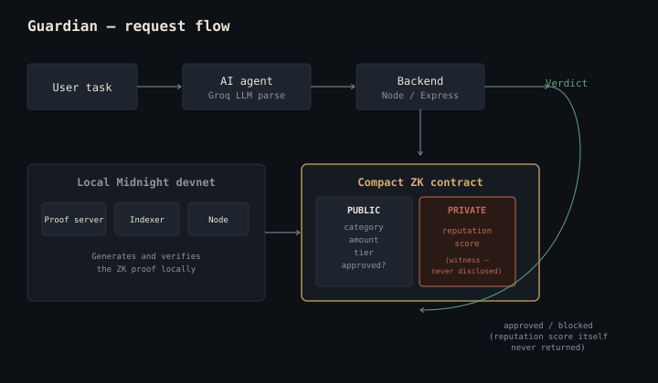

# Guardian — Private AI Spending Agent with Reputation-Gated Guardrails

**Track:** AI Track (Midnight Hackathon, Aug 2026)

## The idea

An AI agent takes a plain-English task ("book me a hotel for $150/night, travel
category") and turns it into a structured action. Before the action is allowed to
execute, it must pass two guardrails enforced by a Midnight (Compact) smart contract:

1. **Spending policy** — the amount must be within the limit for that category + tier.
2. **Reputation gate** — the user's private reputation score must be at or above the
   threshold required for that spending tier. This is proven with a zero-knowledge
   proof — the contract learns "yes, above threshold" without ever seeing the actual
   score.

If both checks pass, the action is approved (simulated execution — no real payments
in this build). If either fails, the agent is blocked, and the failed proof is shown
live. That moment — the guardrail actually stopping the agent in real time — is the demo.

## Why Midnight

Normally, "prove your reputation is good enough" means handing over your full
history to whoever's asking. Midnight lets the user prove *just the fact that
matters* (score ≥ threshold) without exposing the score itself. That's the actual
privacy story here — not just wrapping an API call in blockchain buzzwords.

## Architecture

```
frontend/     simple UI: type a task, watch the agent reason, watch the guardrail decide
backend/      Node.js/Express server: parses task via LLM (Groq), requests the guardrail check
contracts/    Compact contract: spending policy + private reputation threshold check
docs/         notes, demo script, submission write-up drafts
```

## Status

- [x] Compact toolchain + local Midnight devnet running (WSL2 + Docker)
- [x] Real `guardian.compact` contract written and compiling (`k=9, rows=230`)
- [x] Spending policy check in Compact
- [x] Reputation threshold check (private witness, ZK proof)
- [x] Automated tests against local devnet — **3/3 passing**: approve tier-1 spend,
      block tier-3 spend on insufficient reputation, approve tier-3 spend on
      sufficient reputation (see `contracts/test/guardian.test.ts`)
- [x] Backend: LLM parses task → structured action (Groq, `openai/gpt-oss-120b`)
- [x] Backend: wires action into guardrail check, returns pass/fail + reason
- [x] Frontend: UI showing the agent's reasoning and the guardrail verdict
- [ ] Live backend → real deployed contract wiring (currently: backend uses a JS
      mock of the same guardrail logic; the real contract is proven correct via
      the automated tests above, not yet called live on every request — see
      `docs/PROJECT_PLAN.md` for the reasoning)
- [ ] Demo video
- [ ] Devpost write-up

## What's real vs. simulated (read this first)

- **Real:** `contracts/guardian.compact` deploys to a local Midnight devnet and is
  verified by 3 passing automated tests, proving the spending policy *and* the
  private reputation threshold check both work correctly against real Midnight
  infrastructure.
- **Simulated in the live demo:** the Express backend (`backend/src/proof.js`)
  currently evaluates the same guardrail logic in plain JS rather than calling the
  deployed contract on every request, so the interactive demo stays fast and
  reliable. The logic is identical to what's proven in the contract tests.

## How it works



A plain-English task is parsed by an AI agent into a structured action
(category, amount, tier). That action is checked by a real Compact
zero-knowledge contract against two guardrails:

- **Spending policy** (public) — is the amount within the limit for this category/tier?
- **Reputation gate** (private) — does the user's reputation clear the tier's
  threshold? This is proven via ZK: the score itself is a private witness and
  is never disclosed, only the pass/fail of the comparison.

Both checks are enforced on-chain, on a local Midnight devnet, with 4/4
automated tests passing (see `contracts/test/guardian.test.ts`) — including a
test that grows a user's reputation from repeated approved actions until a
previously-blocked spend clears the gate.

## Local setup

See `docs/SETUP.md` for step-by-step environment setup (Compact toolchain, Node, etc).
See `contracts/test/guardian.test.ts` for the automated proof of the real contract.
